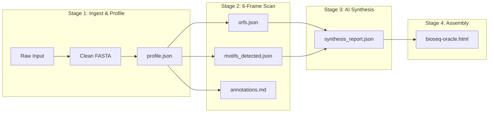

# BioSeq Oracle

> **In Silico Sequence Intelligence & Molecular Biology Workbench**  
> *Offline · Zero API Key · Model Workspace Protocol (MWP) · 100% Pure Standard Library*

[](https://matthew-raphael.github.io/bioseq-oracle/)
[](#automated-testing)
[](#core-architectural-principles)
[](#architecture--the-5-layer-model-workspace-protocol)
[-orange)](#core-architectural-principles)

---

## Overview: What is BioSeq Oracle?

Computers run on binary software written in **1s and 0s**.  
Living organisms run on genetic software written with **4 chemical letters: A, T, C, and G** (DNA and RNA). 

In nature, long sequences of these letters act as digital recipe books, instructing living cells how to build **proteins**—the microscopic engines, antibodies, and hormone signals (such as insulin) that make life work.

**BioSeq Oracle is an all-in-one interactive code editor and simulator for DNA.** When a user pastes in a genetic sequence, the engine decodes the underlying biological program in **under 4 milliseconds**:
- Identifying hidden protein recipes across all forward and reverse reading paths.
- Translating genetic code into real protein primary structures.
- Simulating wet-lab molecular cloning cuts and UV fluorescent gel experiments.
- Assessing whether single-letter mutations cause disease or remain harmless.
- Generating expert scientific narratives—**all 100% offline with zero cloud API keys, zero npm packages, and zero pip installations**.

Built around a **5-Layer Model Workspace Protocol (MWP)**, BioSeq Oracle draws a strict line between **exact mathematical physics** and **contextual narrative synthesis**, completely eliminating the mathematical hallucinations common in standard AI tools.

---

## Key Capabilities

### 1. Interactive Multi-Track Linear Genome Browser
*A visual blueprint that turns thousands of abstract genetic letters into an intuitive, interactive map.*
- **Dynamic Coordinate Ruler**: Scalable 1-indexed coordinate scale with major and minor tick marks ($1 \dots N\text{ bp}$).
- **Dual-Strand Display**: Simultaneous visualization of the sense ($5'\to 3'$) and antisense ($3'\to 5'$) strands.
- **6-Frame ORF Chevrons**: Directional chevron arrows color-coded by reading frame (`+1`, `+2`, `+3`, `-1`, `-2`, `-3`).
- **Restriction Cleavage Pins**: Pinpoint markers for molecular scissor cut sites (EcoRI, BamHI, HindIII, NotI, XhoI, PstI, etc.).
- **Interactive Sequence Inspector**: Clicking or hovering any feature arrow instantly jumps to and highlights the corresponding letters in the sequence inspector.
- **Sliding-Window GC Content & Skew Plot**: Real-time SVG curve graphing local stability and GC Skew $\left(\frac{G - C}{G + C}\right)$, used by geneticists to pinpoint replication origins (*oriC*).

### 2. Full 6-Frame Open Reading Frame (ORF) & Protein Translation Engine
*Decoding the true protein recipes hidden inside double-stranded DNA.*
- **Bidirectional 6-Frame Scanning**: DNA is read in 3-letter words and can be read forward or backward across 3 offsets. BioSeq Oracle scans all 6 paths to identify every legitimate protein-coding span ($\ge 15\text{ nt}$).
- **Protein Primary Sequence Translation**: Translates nucleotide codons into standard IUPAC amino acid sequences (`Met-Gly-Ser...`).
- **Biochemical Property Calculation**: Computes exact monoisotopic peptide molecular weights (Da) and predicts the isoelectric point (pI) using the Bjellqvist multi-pK charge balance model.
- **One-Click Export**: Copy clean Protein FASTA records with a single click.

### 3. Virtual Agarose Gel Electrophoresis Simulator
*Bringing wet-lab laboratory verification directly into the browser.*
- **Simulated 302nm UV Transilluminator Chamber**: High-contrast digital darkroom experience.
- **DNA Molecular Weight Standards**: Standard NEB 1 kb Plus DNA Ladder (10,000 bp down to 250 bp).
- **Physics-Based Migration**: Simulates electrophoretic mobility according to real logarithmic migration physics:
  $$\text{Migration Distance} \propto -\log_{10}(\text{Fragment Length in bp})$$
- **Single & Double Digest Simulation**: Interactive enzyme chips let users simulate single or double digests in real time, with band brightness proportional to DNA fragment mass.

### 4. In Silico Variant & Mutation Impact Inspector
*Testing whether a single DNA typo causes disease or remains harmless.*
- **Interactive Single-Nucleotide Variant (SNV) Simulator**: Test any letter position ($1 \dots N$) with alternative bases.
- **Real-Time Functional Classification**:
  - **Synonymous / Silent (Green)**: The codon changes, but the resulting amino acid is identical. Harmless!
  - **Missense (Amber)**: The codon changes the amino acid to a different chemical building block, potentially altering protein folding or function.
  - **Nonsense / Truncating (Red)**: The typo introduces an accidental stop codon, chopping the protein in half.

### 5. Multi-Format Industrial Export
*Lab-ready file formats compatible with commercial bioinformatics software.*
- **FASTA** (`.fasta`): Standard 60-character wrapped nucleotide sequence with structured identifier header.
- **NCBI GenBank** (`.gb`): Flatfile record with full CDS annotations, coordinates, and origin sequence.
- **JSON Payload** (`.json`): Comprehensive machine-readable data payload for automated bioinformatics pipelines.

---

## Architecture: The 5-Layer Model Workspace Protocol (MWP)

BioSeq Oracle is organized into strict hierarchical layers that guarantee deterministic reproducibility and transparent auditability:

```
bioseq-workspace/
├── AGENTS.md                    ← Layer 0 · Workspace Identity & Agent Governance
├── CONTEXT.md                   ← Layer 1 · Pipeline Routing, Dependencies & Review Gates
│
├── _config/                     ← Layer 3 (Global) · Immutable Reference Constants
│   ├── motifs.json              ← Canonical biological motif catalog & regex signatures
│   ├── thresholds.md            ← Validation limits, MW constants, and severity rules
│   └── design_system.css        ← Design tokens, color scales, and layout primitives
│
├── shared/                      ← Mechanical Computation & Tooling
│   ├── scripts/
│   │   ├── bio_profiler.js      ← Deterministic: cleaning, GC%, MW, SantaLucia Tm
│   │   ├── orf_scanner.js       ← Deterministic: 6-frame ORFs, translation, digest
│   │   ├── synthesis_engine.js  ← Deterministic AI: archetypes & heuristic synthesis
│   │   ├── pipeline.py          ← End-to-end CLI pipeline orchestrator
│   │   ├── compile_ui.py        ← Zero-dependency Python 3 HTML bundler
│   │   └── compile_ui.js        ← Node.js HTML bundler
│   └── templates/
│       ├── report_template.md   ← Markdown template for synthesis reports
│       └── viewer_template.html ← Standalone HTML5/SVG application template
│
├── stages/                      ← Layer 2 (Contracts) & Layer 4 (Artifacts)
│   ├── 01_ingest_profile/       ← Ingestion, FASTA cleaning, physicochemical stats
│   ├── 02_motif_orf_scan/       ← 6-frame ORF mapping, motif scanning, digest
│   ├── 03_biological_synthesis/ ← AI narrative synthesis & archetype classification
│   └── 04_ui_assembly/          ← Compiles self-contained bioseq-oracle.html
│
└── tests/                       ← Automated Quality Assurance
    └── test_pipeline.py         ← 15 unit/integration tests with NCBI ground truth
```



---

## Scientific Ground Truth & Mathematical Formats

| Property | Method / Source | Formula / Reference |
| :--- | :--- | :--- |
| **GC Content** | Standard Stoichiometry | $\text{GC\%} = \frac{\text{Count}(G + C)}{\text{Length}} \times 100$ |
| **Melting Temp ($<20\text{ nt}$)** | Wallace Rule (1979) | $T_m = 2(A + T + U) + 4(G + C)$ |
| **Melting Temp ($\ge 20\text{ nt}$)** | Marmur-Schildkraut-Doty (1962) | $T_m = 64.9 + 41.0 \times \frac{\text{Count}(G + C) - 16.4}{\text{Length}}$ |
| **Nearest-Neighbor $T_m$** | SantaLucia Unified Model (1998) | $T_m = \frac{1000 \cdot \Delta H^\circ}{\Delta S^\circ + R \ln(C_T/4)} - 273.15$ with $[Na^+] = 50\text{ mM}$ |
| **Isoelectric Point (pI)** | Bjellqvist Model (1993) | Iterative root-finding where $\sum \text{Charge}_i(\text{pH}) = 0$ |
| **GC Skew** | Replication Origin Analysis | $\text{GC Skew} = \frac{G - C}{G + C}$ across sliding window |
| **Electrophoresis** | Logarithmic Migration | $\text{Distance} \propto -\log_{10}(\text{Fragment Length})$ |

---

## Quickstart

### 1. Launch the Web Application
- **Hosted Live Demo**: [https://matthew-raphael.github.io/bioseq-oracle/](https://matthew-raphael.github.io/bioseq-oracle/)
- **Local Offline Browser**:
  ```bash
  open index.html
  ```
  *(Or compile fresh from source:)*
  ```bash
  python3 shared/scripts/compile_ui.py
  ```

### 2. Run the End-to-End CLI Pipeline
Analyze reference benchmarks or custom sequences through all 4 pipeline stages:
```bash
# Run with Human Insulin ground truth
python3 shared/scripts/pipeline.py --example insulin

# Run with TP53 tumor suppressor ground truth
python3 shared/scripts/pipeline.py --example p53

# Run with a custom sequence
python3 shared/scripts/pipeline.py --input "ATGGGCAGCCCCCGCCCAGCCCTGCTTCTGGTGGCTCTCTTTGTGGTCCTCACCCTCCTGGCTCTCCTGGCCCTCAGCCCTGGAGATCAAATGTGCCCCAGGGCCCTTGGCAGATGAAACTGCAACCTTTGACCCAGG"

# Output structured JSON payload
python3 shared/scripts/pipeline.py --example insulin --json
```

---

## Automated Testing

The repository includes an automated test suite validating algorithms against NCBI reference sequences:

```bash
python3 -m unittest discover -s tests -v
```

```
test_clean_sequence_dirty_input (test_pipeline.TestBioProfiler) ... ok
test_clean_sequence_fasta (test_pipeline.TestBioProfiler) ... ok
test_detect_molecule_type (test_pipeline.TestBioProfiler) ... ok
test_gc_content_calculation (test_pipeline.TestBioProfiler) ... ok
test_molecular_weight (test_pipeline.TestBioProfiler) ... ok
test_tm_estimation (test_pipeline.TestBioProfiler) ... ok
test_insulin_synthesis_archetype (test_pipeline.TestBiologicalSynthesis) ... ok
test_novel_sequence_heuristic_synthesis (test_pipeline.TestBiologicalSynthesis) ... ok
test_p53_synthesis_archetype (test_pipeline.TestBiologicalSynthesis) ... ok
test_tata_and_hindiii_motifs (test_pipeline.TestMotifScanner) ... ok
test_insulin_orf_detection (test_pipeline.TestORFScannerAndTranslation) ... ok
test_protein_mw_and_pi (test_pipeline.TestORFScannerAndTranslation) ... ok
test_reverse_strand_orf (test_pipeline.TestORFScannerAndTranslation) ... ok
test_translate_codons (test_pipeline.TestORFScannerAndTranslation) ... ok
test_full_pipeline_run (test_pipeline.TestPipelineEndToEnd) ... ok

----------------------------------------------------------------------
Ran 15 tests in 0.008s

OK (100% Passed)
```

---

## Core Architectural Principles

1. **Deterministic Precision vs. AI Synthesis**: Core biophysical calculations (thermodynamic melting temperatures, molecular weights, 6-frame translations, and restriction fragment lengths) are strictly deterministic and mathematically guaranteed. The AI synthesis engine focuses purely on high-level biological categorization, preventing numeric hallucinations.
2. **Zero External Dependencies**: The entire project—including the CLI orchestrator, test suite, and web application—relies exclusively on the Python 3 standard library and native browser web standards (HTML5, SVG, CSS, JavaScript). It runs out of the box on any system without package managers.
3. **High-Performance Lightweight Visualization**: Custom SVG engines drive the multi-track linear genome browser, GC curves, and virtual agarose gel without bulky external visualization libraries.
4. **Structured Agentic Compatibility**: Designed following the Model Workspace Protocol (MWP), allowing autonomous agents or humans to inspect, audit, and modify structured artifacts between pipeline stages.

---

## License

MIT License. Designed for research, educational, and computational biology use.
