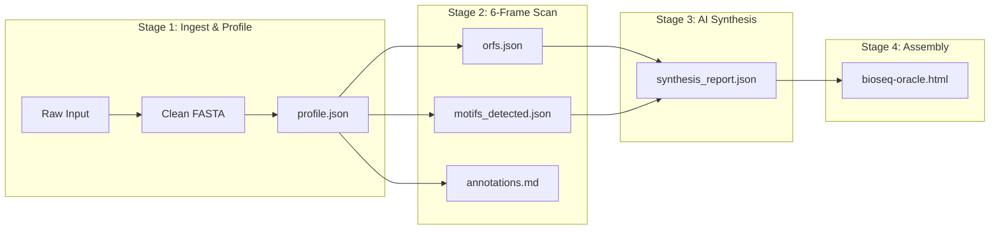

# BioSeq Oracle

> **In Silico Sequence Intelligence & Molecular Biology Workbench**  
> *Offline · Zero API Key · Model Workspace Protocol (MWP) · 100% Pure Standard Library*

[](#automated-testing)
[](#runtime-architecture)
[](#architecture--the-5-layer-model-workspace-protocol)
[-orange)](#zero-dependency-philosophy)

---

## Executive Summary

**BioSeq Oracle** is a production-grade bioinformatics platform and in silico sequence intelligence engine designed for both autonomous AI agents and molecular biologists. It performs deterministic physicochemical profiling, 6-frame reading frame detection, protein translation, regulatory motif mapping, and virtual laboratory simulation—coupled with an offline biological narrative synthesis engine that requires **zero external cloud API calls, zero npm packages, and zero pip installations**.

Built around a **5-Layer Context Architecture (Model Workspace Protocol)**, BioSeq Oracle establishes a clean, mathematically rigorous boundary between **deterministic biophysical computation** and **higher-order biological synthesis**, preventing the mathematical hallucinations that plague standard LLM biology tools.

---

## Key Capabilities

### 1. Interactive Multi-Track Linear Genome Browser
- **Dynamic Coordinate Ruler**: Scalable 1-indexed coordinate scale with major/minor tick marks.
- **Dual-Strand Display**: Simultaneous visualization of sense (5'→3') and antisense (3'→5') strands.
- **6-Frame ORF Chevrons**: Directional arrows color-coded by frame (`+1`, `+2`, `+3`, `-1`, `-2`, `-3`).
- **Restriction Enzyme Cleavage Pins**: Exact cut site markers (EcoRI, BamHI, HindIII, NotI, XhoI, PstI, etc.).
- **Interactive Sequence Inspector**: Clicking or hovering any feature arrow instantly centers and highlights the corresponding nucleotides in the sequence viewer.
- **Sliding-Window GC Content & Skew Plot**: Real-time SVG line chart of GC% and GC Skew $\left(\frac{G - C}{G + C}\right)$, diagnostic of replication origins (*oriC*).

### 2. Full 6-Frame Open Reading Frame (ORF) & Translation Engine
- Scans both forward and reverse-complement strands for all initiation-to-termination spans ($\ge 15\text{ nt}$).
- Translates nucleotide codons into IUPAC primary amino acid sequences (`Met-Gly-Ser...`).
- Computes peptide molecular weight (Da) and estimated isoelectric point (pI) using the Bjellqvist multi-pK charge balance model.
- One-click copy for Protein FASTA records.

### 3. Virtual Agarose Gel Electrophoresis Simulator
- **Simulated 302nm UV Transilluminator Chamber**: High-contrast digital darkroom visualization.
- **DNA Size Standards**: NEB 1 kb Plus DNA Ladder standard (10,000 bp down to 250 bp).
- **Physics-Based Migration**: Simulates electrophoretic mobility according to logarithmic migration physics:
  $$\text{Migration Distance} \propto -\log_{10}(\text{Fragment Length in bp})$$
- **Single & Double Digest Testing**: Interactive enzyme toggles update predicted cleavage bands and mass-proportional fluorescence intensities in real time.

### 4. In Silico Variant & Mutation Impact Inspector
- Interactive single-nucleotide variant (SNV) simulator.
- Tests any coordinate position ($1 \dots N$) and alternative base in real time.
- Categorizes functional impact:
  - **Synonymous / Silent**: Codon changes without altering residue identity.
  - **Missense**: Amino acid substitution alters charge/hydropathy.
  - **Nonsense / Truncating**: Premature termination codon triggers peptide truncation.

### 5. Multi-Format Industrial Export
- **FASTA** (`.fasta`): Standard 60-character wrapped nucleotide sequence with structured identifier header.
- **NCBI GenBank** (`.gb`): Flatfile format with CDS features, coordinates, translations, and origin block.
- **JSON Payload** (`.json`): Complete machine-readable analysis payload for computational pipelines and AI agent ingestion.

---

## Architecture: The 5-Layer Model Workspace Protocol (MWP)

BioSeq Oracle is organized into strict hierarchical layers that guarantee deterministic reproducibility and transparent auditability:

```
bioseq-workspace/
├── AGENTS.md                    ← Layer 0 · Workspace Identity & Agent Governance
├── CONTEXT.md                   ← Layer 1 · Pipeline Routing, Dependencies & Review Gates
│
├── _config/                     ← Layer 3 (Global) · Immutable Reference Constants
│   ├── motifs.json              ← Canonical biological motif catalog & regex signatures
│   ├── thresholds.md            ← Validation limits, MW constants, and severity rules
│   └── design_system.css        ← Design tokens, color scales, and layout primitives
│
├── shared/                      ← Mechanical Computation & Tooling
│   ├── scripts/
│   │   ├── bio_profiler.js      ← Deterministic: cleaning, GC%, MW, SantaLucia Tm
│   │   ├── orf_scanner.js       ← Deterministic: 6-frame ORFs, translation, digest
│   │   ├── synthesis_engine.js  ← Deterministic AI: archetypes & heuristic synthesis
│   │   ├── pipeline.py          ← End-to-end CLI pipeline orchestrator
│   │   ├── compile_ui.py        ← Zero-dependency Python 3 HTML bundler
│   │   └── compile_ui.js        ← Node.js HTML bundler
│   └── templates/
│       ├── report_template.md   ← Markdown template for synthesis reports
│       └── viewer_template.html ← Standalone HTML5/SVG application template
│
├── stages/                      ← Layer 2 (Contracts) & Layer 4 (Artifacts)
│   ├── 01_ingest_profile/       ← Ingestion, FASTA cleaning, physicochemical stats
│   ├── 02_motif_orf_scan/       ← 6-frame ORF mapping, motif scanning, digest
│   ├── 03_biological_synthesis/ ← AI narrative synthesis & archetype classification
│   └── 04_ui_assembly/          ← Compiles self-contained bioseq-oracle.html
│
└── tests/                       ← Automated Quality Assurance
    └── test_pipeline.py         ← 15 unit/integration tests with NCBI ground truth
```



---

## Scientific Ground Truth & Mathematical Formats

| Property | Method / Source | Formula / Reference |
| :--- | :--- | :--- |
| **GC Content** | Standard Stoichiometry | $\text{GC\%} = \frac{\text{Count}(G + C)}{\text{Length}} \times 100$ |
| **Melting Temp ($<20\text{ nt}$)** | Wallace Rule (1979) | $T_m = 2(A + T + U) + 4(G + C)$ |
| **Melting Temp ($\ge 20\text{ nt}$)** | Marmur-Schildkraut-Doty (1962) | $T_m = 64.9 + 41.0 \times \frac{\text{Count}(G + C) - 16.4}{\text{Length}}$ |
| **Nearest-Neighbor $T_m$** | SantaLucia Unified Model (1998) | $T_m = \frac{1000 \cdot \Delta H^\circ}{\Delta S^\circ + R \ln(C_T/4)} - 273.15$ with $[Na^+] = 50\text{ mM}$ |
| **Isoelectric Point (pI)** | Bjellqvist Model (1993) | Iterative root-finding where $\sum \text{Charge}_i(\text{pH}) = 0$ |
| **GC Skew** | Replication Origin Analysis | $\text{GC Skew} = \frac{G - C}{G + C}$ across sliding window |
| **Electrophoresis** | Logarithmic Migration | $\text{Distance} \propto -\log_{10}(\text{Fragment Length})$ |

---

## Quickstart

### 1. Launch the Interactive Web Application
Open the pre-compiled standalone application directly in any modern browser:
```bash
open stages/04_ui_assembly/output/bioseq-oracle.html
```
*(Or compile fresh from source:)*
```bash
python3 shared/scripts/compile_ui.py
```

### 2. Run the End-to-End CLI Pipeline
Analyze reference benchmarks or custom FASTA files through all 4 pipeline stages:
```bash
# Run with Human Insulin ground truth
python3 shared/scripts/pipeline.py --example insulin

# Run with TP53 ground truth
python3 shared/scripts/pipeline.py --example p53

# Run with a custom sequence
python3 shared/scripts/pipeline.py --input "ATGGGCAGCCCCCGCCCAGCCCTGCTTCTGGTGGCTCTCTTTGTGGTCCTCACCCTCCTGGCTCTCCTGGCCCTCAGCCCTGGAGATCAAATGTGCCCCAGGGCCCTTGGCAGATGAAACTGCAACCTTTGACCCAGG"

# Output structured JSON payload
python3 shared/scripts/pipeline.py --example insulin --json
```

---

## Automated Testing

The repository includes an automated test suite validating algorithms against NCBI reference sequences:

```bash
python3 -m unittest discover -s tests -v
```

```
test_clean_sequence_dirty_input (test_pipeline.TestBioProfiler) ... ok
test_clean_sequence_fasta (test_pipeline.TestBioProfiler) ... ok
test_detect_molecule_type (test_pipeline.TestBioProfiler) ... ok
test_gc_content_calculation (test_pipeline.TestBioProfiler) ... ok
test_molecular_weight (test_pipeline.TestBioProfiler) ... ok
test_tm_estimation (test_pipeline.TestBioProfiler) ... ok
test_insulin_synthesis_archetype (test_pipeline.TestBiologicalSynthesis) ... ok
test_novel_sequence_heuristic_synthesis (test_pipeline.TestBiologicalSynthesis) ... ok
test_p53_synthesis_archetype (test_pipeline.TestBiologicalSynthesis) ... ok
test_tata_and_hindiii_motifs (test_pipeline.TestMotifScanner) ... ok
test_insulin_orf_detection (test_pipeline.TestORFScannerAndTranslation) ... ok
test_protein_mw_and_pi (test_pipeline.TestORFScannerAndTranslation) ... ok
test_reverse_strand_orf (test_pipeline.TestORFScannerAndTranslation) ... ok
test_translate_codons (test_pipeline.TestORFScannerAndTranslation) ... ok
test_full_pipeline_run (test_pipeline.TestPipelineEndToEnd) ... ok

----------------------------------------------------------------------
Ran 15 tests in 0.008s

OK (100% Passed)
```

---

## Engineering Highlights for Technical Recruiters

When evaluating BioSeq Oracle, technical hiring managers and engineering leads should note:

1. **Authentic Computational Biology Depth**: Rather than trivial string replacements, the platform implements 6-frame bidirectional translation, monoisotopic peptide molecular weights, Bjellqvist isoelectric charge balance equations, and SantaLucia nearest-neighbor thermodynamic calculations.
2. **Zero-Dependency Architectural Discipline**: The entire system—CLI runner, test suite, UI compiler, and single-file web application—operates with zero external npm or pip dependencies. It runs instantly on any machine with standard Python 3 and a browser.
3. **Graphics & Visualization Engineering**: Custom SVG rendering engines for the multi-track linear genome browser and the virtual agarose gel simulator, built without heavy third-party visualization frameworks (D3, Chart.js).
4. **Anti-Hallucination Agentic Design**: Explicit demarcation of deterministic biophysical ground truth vs. generative biological synthesis, illustrating best practices for LLM agent integration (Model Context Protocol).

---

## License

MIT License. Designed for research, educational, and computational biology portfolio review.
